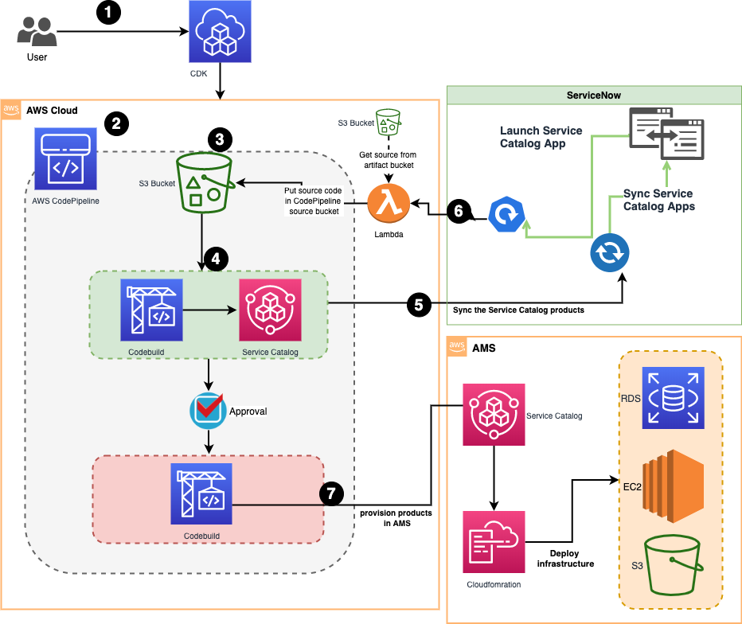

# Using AWS Service Catalog and the AWS Service Management Connector for ServiceNow to deliver infrastructure in AMS-governed environments

This solution shows how to perform automated infrastructure deployment to an AMS managed account from a non-AMS account (the source AWS account). The development tool (in our solution, AWS CodePipeline) is running in the source AWS account. The account is used to register the product package in AWS Service Catalog and ServiceNow.

The CI/CD pipeline assumes a cross account role to register and provision the product in AWS Service Catalog in the AMS account. After the product has been successfully registered in AWS Service Catalog, the product is deployed in the AMS account.

The solution covers the following:
- Automated deployment of infrastructure using CI/CD pipelines to AMS.
- Use of AWS Service Catalog instead of the AMS console.
- ServiceNow integration with CI/CD pipelines to orchestrate deployments and rollbacks. 

After the product has been packaged and uploaded to an Amazon Simple Storage Service (Amazon S3) bucket, the CI/CD pipeline is triggered. The pipeline registers the product in AWS Service Catalog in the source AWS account. Each version of the deployed package is registered and made available in ServiceNow for future deployments and rollbacks. 

## Prerequisites
- An AWS account. This is the non-AMS account that is used to deploy the CI/CD pipeline.
- An AMS account.
- [AWS Managed Services (AMS) CloudFormation Deployment Requirements](https://aws.amazon.com/managed-services/)
The AWS CLI.
- The AWS CDK (TypeScript). 
- [AWS Service Management Connector for ServiceNow](https://docs.aws.amazon.com/servicecatalog/latest/adminguide/integrations-servicenow.html)

For CDK information, see [Getting started with the AWS CDK in the AWS Cloud Development Kit Developer Guide](https://docs.aws.amazon.com/cdk/latest/guide/getting_started.html).


## Architecture



1.	The user uses the AWS Cloud Development Kit to deploy this solution in their source AWS account.
2.	AWS CodePipeline orchestrates deployments to the AMS account and updates the AWS Service Catalog portfolio.
3.	The user uploads the deployment package to an S3 bucket. An S3 event is triggered, which starts the pipeline.
4.	A project in [AWS CodeBuild](https://aws.amazon.com/codebuild/) registers the product in the AWS Service Catalog portfolio.
5.	After the product is registered in AWS Service Catalog, the [AWS Service Management Connector for ServiceNow](https://docs.aws.amazon.com/servicecatalog/latest/adminguide/integrations-servicenow.html) syncs the portfolio with ServiceNow. This synchronization makes it possible to deploy any registered version of the product from ServiceNow. The connector uses a IAM user, it is recommended that access keys for the users are rotated on an regular basis. For details, see [Rotating Access Keys (AWS CLI, Tools for Windows PowerShell, and AWS API)](https://docs.aws.amazon.com/IAM/latest/UserGuide/id_credentials_access-keys.html#Using_RotateAccessKey) in the IAM User Guide and [How to Rotate Access Keys for IAM Users](https://aws.amazon.com/blogs/security/how-to-rotate-access-keys-for-iam-users/) on the AWS Security Blog.
6.	When the product is also deployed from ServiceNow, the AWS Service Management Connector for ServiceNow triggers a AWS CloudFormation template, triggering a [AWS Lambda](https://aws.amazon.com/blogs/security/how-to-rotate-access-keys-for-iam-users/) to copy the source from an artifact bucket to the source code CodePipeline bucket.
7.	The AWS CodeBuild project uses AWS Service Catalog in the AMS account to register and provision the product.


## Deployment
- In the AMS account, create an RFC to request the cross account role. 
    - For the IAM role name, enter `ci_cd_ams_cross_account_role`. 
    - For trusted entity, enter `arn:aws:iam::<SourceAWSAccountId>:role/CI-CD-Pipeline`. 
    - For the managed policy to attach, enter `arn:aws:iam::<AMSAccountId>:policy/AMSCustomerServiceCatalogAdminPolicy`.
- In the AMS account, create an RFC to create the S3 bucket. The bucket name prefix must be sc-.
- Clone the Git repository for this solution.
- In the source AWS account, build and deploy the CDK application: 
    - `cd to application root directory`
    - `npm install`
    - `npm run build`
    - `cdk deploy ams-pipeline 
--parameters crossAccountRole=" arn:aws:iam::<AMSAccountId>:role/ci_cd_ams_cross_account_role" 
--parameters LaunchRole="arn:aws:iam::<AMSAccountId>:role/AWSManagedServicesServiceCatalogLaunchRole" 
--parameters bucketname="<Name of the bucket created in step 2>"`

- Build the IAM users and role to be used by ServiceNow to sync the AWS Service Catalog products using the AWS Service Management Connector for ServiceNow.
    - `cdk deploy SnowRoles`
- Create the access keys for two users (SCSync and SCEndUser) that were created by the SnowRoles stack in the previous step. 
- Follow the configuration instructions in the AWS Service Catalog Administration Guide to integrate ServiceNow with AWS Service Catalog in the source AWS account. Use the access keys created in the previous step.


## Folder structure
Below explanation excludes files created by CDK.
```
CI-CD-AMS-SC
├── bin
│   └── cicd.ts                        Main CDK source file to deploy stacks.
├── lib                                Python source code
│   ├── assets                         Lambad code (See step 5 in architecture diagram)
│   │   ├── index.py                    Handler code
│   │   └── python.zip                  Lambda Layer (request package)              
│   ├── iam                            IAM roles and policies used in the solution
│   │   ├── iam.ts                    
│   │   ├── lambda_role.ts                Service roles used by AWS Lambad
│   │   ├── sclaunnch.ts                  Service roles used by AWS Service Catalog
│   │   └── snowrole.ts                   Service roles used by AWS Service Management Connector for ServiceNow              
│   └── pipeline                       Pipline infrastructure code
│       ├── buildspec.yaml                Build Specification file for CodeBuild
│       └── s3SourceAction.ts             Create the CodePipeline as seen in the architecture diagram  
├── resources                          Supporting documents
└── src                                Example product to be deployed to AMS Account.
    ├── buildspec.yaml                     Build Specification file for AWS CodeBuild (step 7 in architecture diagram)
    ├── cloudforation.json                 Infrastructure to be deployed to AMS account
    ├── servicecatalog.py                  Code executed in the AWS CodeBuild
    └── version.json                       Version of the product being deployed
```
